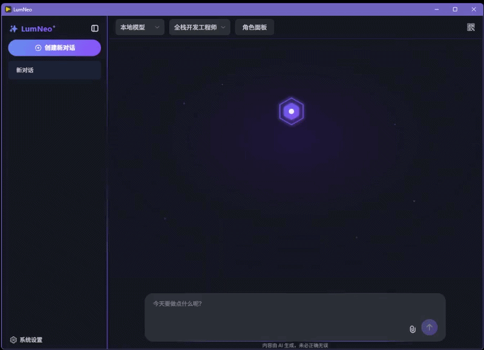

#  LumNeo —  下一代跨平台 AI 智能体工作台


> Build AI that builds hardware.  
> 造一个能造硬件的 AI。  
> 版本里程碑：3.0 版本之前，它是一款通用的 AI 提效工具；3.0 版本起，它将正式进化为硬件开发者的专属智能伙伴。

LumNeo 是一款跨平台 AI 桌面应用，将本地隐私与云端算力融为一体。但它不是又一个通用对话工具——它的起点，是一个硬件爱好者"给自己写的工具箱"。

通过 MCP 协议，LumNeo 让 AI 助手直接读写串口、控制 GPIO、解析寄存器、烧录固件。数据不出机箱，一切跑在本地。

<p align="center">
  
  
</p>
<p align="center">
  
</p>

---

## 🎯 为什么选择 LumNeo？    

### 🔌 硬件设备接入，天生就绪
- **基于 MCP 协议**：串口、USB、蓝牙设备均可通过 MCP Server 接入，无需修改核心代码

- **Python 后端生态**：无缝调用 pyserial、pyusb、esptool 等硬件工具库

- **桌面原生权限**：基于 PyWebView 的桌面容器，直连系统硬件接口，不受浏览器沙箱限制

- 当前版本已具备完整的工具调用链路，你可以现在就通过自定义 MCP Server 接入硬件，无需等待未来版本

### 👥 万千角色，一键切换
- **自由创建专属角色**：定义独特人格、Prompt 与能力边界
- **独立工具绑定**：为每个角色配置专属 MCP 服务与本地工具白名单
- **无缝切换**：上一秒是代码审查员，下一秒变文案编辑，专业的人做专业的事

### 📄 文件读写，如臂使指
- **拖拽即解析**：图片供视觉模型理解，文档自动提取结构与细节
- **直接写入结果**：提出修改需求后，AI 可直接生成并保存文件，无需手动复制粘贴

### 🧠 双擎驱动，懂你所想
- **本地模型**：Ollama / LM Studio 离线运行，隐私数据不出本机
- **云端大模型**：OpenAI / DeepSeek 等一键接入，破解复杂难题
- **思考过程透明**：推理内容可折叠展示，思考耗时一目了然

### 🔧 MCP 生态，无限延伸
- 动态工具调用，内置文件读写、天气查询等常用能力
- 支持自定义 MCP 服务器（stdio / SSE / streamable-http），打破桌面应用孤岛

###  ⚡ Skill 技能，即拖即用
- **自定义技能包**：无需预制，你编写的任何脚本、工作流或工具集合都可作为技能文件夹
- **拖入即绑定**：将技能文件夹拖入任意角色，系统自动识别并即时生效，无需重启、无需额外配置
- **按角色独立**：每个角色可拥有专属技能组合，随时增删更换，灵活适配不同任务场景

###  ✨ 细节之处，皆是温度
- **流式对话 + 富文本**：回复逐字浮现，Markdown 实时渲染，代码高亮 + Mermaid 图表
- **暗色 / 浅色主题**：炫酷边框微光、果冻弹性动效，视觉舒适不疲劳
- **会话管理**：新建、重命名、删除对话，历史消息持久化存储
- **Token 用量统计**：每次对话消耗一目了然，支持随时停止生成

---

##  🗺️ 项目愿景与路线图

LumNeo 不仅仅是一个生产力工具，还准备打造一个不断进化的**数字生命体**。

| 阶段 | 版本 | 核心目标 | 状态 |
| :--- | :--- | :--- | :--- |
| **Phase 1** | **v1.0** | **极致生产力底座**<br>实现多模态交互基础，开放 MCP 接口生态，支持Skill，打造轻量级本地 AI 工作台。 |  ✅ |
| **Phase 2** | **v2.0** | **让 AI 记住经验**<br>长期记忆、项目上下文、硬件调试历史追溯，让 AI 成为懂你的搭档 |  🔄规划中 |
| **Phase 3** | **v3.0** | **让 AI 动手干活**<br> 官方硬件接入模板（串口通信、GPIO 控制、传感器读取）、Renode 模拟器集成、固件烧录管理，让 AI 助手真正控制物理世界 |  🔜规划中 |

> 💡 当前版本已支持通过自定义 MCP Server 提前体验硬件功能，无需等待 v3.0。

---

##  🧱 技术栈

| 层级 | 技术选型 | 说明 |
|------|----------|------|
| 桌面容器 | PyWebView | 轻量级原生窗口封装，启动快、资源占用低 |
| 前端框架 | Vue 3 + TypeScript + Naive UI + Vite | 现代化响应式界面，组件化开发 |
| 后端 API | FastAPI (异步) + SQLite (aiosqlite) | 高性能异步接口，本地数据持久化 |
| 模型调用 | openai 库 | 统一兼容 OpenAI / Ollama / LM Studio 等主流协议 |
| 工具扩展 | MCP SDK | 支持 stdio / SSE / streamable-http 三种传输方式 |
| 渲染增强 | marked + highlight.js + mermaid | 完整 Markdown 生态，代码与图表原生支持 |
| 打包分发 | PyInstaller | 跨平台一键构建可执行文件 |

---

## 📂 项目主要结构

```text
LumNeo/
├── app_config.yaml         # 应用配置文件
├── build.bat               # Windows 构建脚本
├── main.py                 # 应用入口（启动 FastAPI + PyWebView）
├── mcp_config.json         # MCP 服务器配置文件 (运行时自动创建)
├── requirements.txt        # Python 依赖清单
├── system_prompt.md        # 系统内置角色 Prompt 模板
├── tools_config.yaml       # 本地工具配置文件
├── backend/
│   ├── database.py         # SQLite 初始化与会话管理
│   ├── mcp_client.py       # MCP 客户端管理器（多角色工具隔离）
│   ├── routes/
│   │   ├── chat.py         # 聊天接口（流式输出、工具调用）
│   │   └── chats.py        # 对话 CRUD 接口
│   ├── services/
│   |   ├── llm_service.py  # 大模型调用服务（含工具循环与角色上下文）
│   |   └── tools.py        # 本地工具动态导入定义与执行引擎
│   └── system_tools/
|       ├── __init__.py     # 系统内置工具定义
|       └── ...             # 其他通用基础工具
├── frontend/               # Vue 3 前端
│   ├── src/
│   │   ├── components/     # ChatWindow / SettingsDrawer / Introduction
│   │   ├── stores/         # chat.ts / config.ts / profiles.ts
│   │   ├── assets/         # global.css / 主题变量
│   │   └── main.ts
│   └── package.json
```

---

## ️🚀 快速开始

在开始之前，请确保你的电脑已安装 **Python 3.12+** 和 **Node.js 18+**。

### 1. 安装后端依赖
```bash
# 使用 conda 创建虚拟环境
conda create -n lumneo python=3.12
conda activate lumneo
pip install -r requirements.txt

# 或者使用自带的`venv`创建虚拟环境
python -m venv lumneo
lumneo\Scripts\activate # Windows
source lumneo/bin/activate  # macOS/Linux
pip install -r requirements.txt
```

### 2. 安装前端依赖
```bash
cd frontend
npm install
```

### 3. 开发模式下启动应用
建议打开两个终端窗口分别运行前后端：

```bash
# 终端 1：启动前端开发服务
cd frontend && npm run dev

# 终端 2：启动后端服务
conda activate lumneo
python main.py

# 提示：如果需要启动 GUI 界面，可以使用 python main.py --gui
```

### 4. 构建可执行文件
目前支持 Windows 一键构建，其他系统请参考 PyInstaller 文档自行配置：
```bash
# Windows
build.bat
```

---

## ️⚙️ 配置 MCP 服务器

编辑根目录 `mcp_config.json` 即可为角色接入外部工具：

```json
{
  "mcpServers": {
    "assistant": {
      "command": "bash",
      "args": ["-lc", "/path/to/start.sh"]
    },
    "remote-tool": {
      "url": "http://127.0.0.1:8000/mcp"
    },
    "hardware-serial": {
      "command": "python",
      "args": ["-m", "hardware_mcp", "--port", "COM3"]
    }
  }
}
```
> 💡 **开发与打包环境的区别**：
> *   **开发模式下**：直接修改项目根目录的 `mcp_config.json` 即可生效。
> *   **打包运行 (.exe) 时**：为了符合系统规范，配置文件会自动生成并存储在系统的程序数据目录下。如果你使用的是打包后的版本，请前往以下路径修改配置：
>     *   Windows: `C:\ProgramData\.LumNeo\mcp_config.json`


>  **提示**：LumNeo 支持 `stdio`、`sse`、`streamable-http` 三种传输方式。你可以在角色设置中为不同角色绑定不同的 MCP 服务组合，打造专属工作流。

---

## 💡 给硬件开发者的一句话
**LumNeo** 的后端基于 Python FastAPI，天然支持 pyserial、pyusb、esptool 等硬件工具库。如果你正在开发 AIoT 或嵌入式工具链，LumNeo 可以作为你的 **AI 控制台前端**——通过 MCP 协议将硬件能力暴露给 AI 助手，让大模型直接读写串口、控制 GPIO、烧录固件。**当前版本已具备完整的工具调用链路，无需等待未来版本**。

> 实话实说：这个项目最开始就是给我自己用的。 因为找不到一个既能跟 AI 聊天、又能直接操作串口和寄存器的桌面工具，我就自己写了一个。如果你也有同样的烦恼，欢迎上车。
---

## ️🖼️ 界面预览

| 深色主题 | 浅色主题 |
|---------|---------|
|  |  |

更多截图请查看 [screenshots](screenshots/) 目录。

---

## 🤝 参与贡献

欢迎提 Issue、Pull Request，或分享你的角色配置、MCP 工具和 Skill。**特别欢迎硬件方向的贡献者**——如果你开发了串口调试、传感器数据读取、固件烧录等硬件 MCP 工具，欢迎提交到社区，一起打造 **AI 原生硬件开发工作台**。 

LumNeo 因你而更温暖，每一行代码都是点亮灵感的光 ✨

---

## 📄 开源许可

本项目基于 [Apache License 2.0](./LICENSE) 开源。

Copyright © 2026 [柯一_-](https://github.com/lumneo)

---

*LumNeo — 点亮每个想要被看见的瞬间。*  
*让我，做你桌面上那盏不灭的灵感之灯。*

