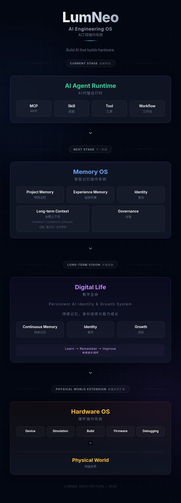
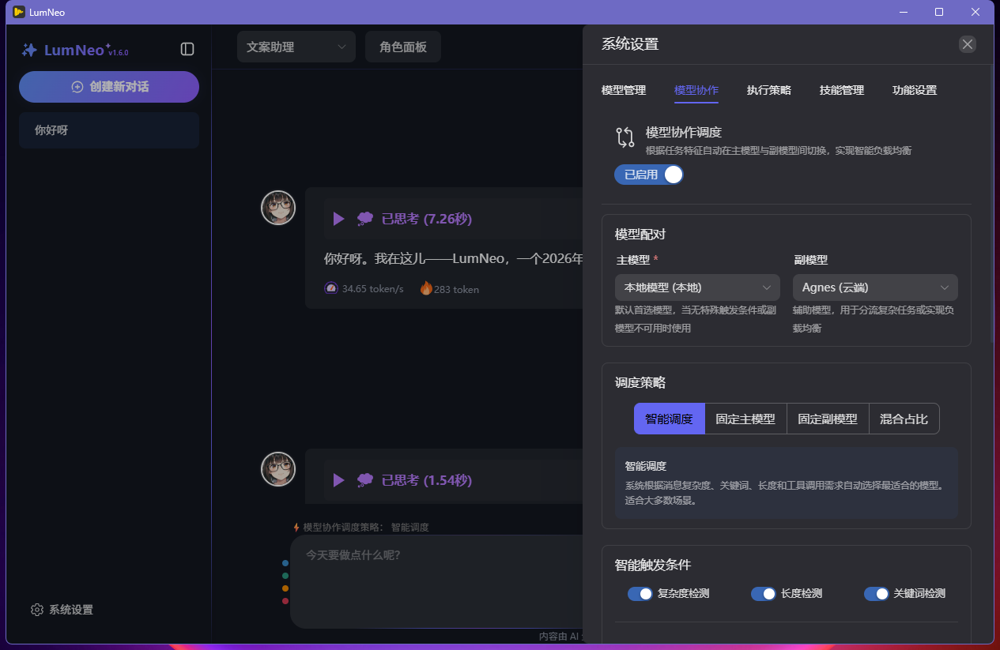

# LumNeo — AI Engineering OS


> **Build AI that builds.**  
> **让 AI 不只是聊天，而是真正参与创造。**

LumNeo 目前是一个面向工程领域的 AI Agent Runtime。

它以 AI Agent Runtime 为基础，正在构建 Memory OS 与 Hardware OS 两个核心能力层，探索下一代 AI 工程系统。

LumNeo 不是又一个 AI 聊天客户端，而是在探索下一代 AI 工作方式：

- AI 可以使用真实工具，将语言能力转化为行动能力
- AI 可以组合专业 Skill，执行复杂任务和工作流程
- AI 可以理解项目上下文，参与长期工程协作
- AI 可以积累经验，并将有效经验沉淀为可复用能力
- AI 可以通过 Memory OS 探索长期记忆和经验演化能力
- AI 可以通过 Hardware OS 逐步连接真实设备，参与物理世界创造

当前版本专注于打造：

> **一个开放、可扩展、本地优先的 AI Agent Runtime。**

LumNeo 让 AI Agent 从单次任务执行，逐步演化为具备工具、技能与经验积累能力的长期工程伙伴。  

未来 LumNeo 将逐步演化：

```
           LumNeo AI Engineering OS


                 Agent Runtime
                       │
          ┌────────────┴────────────┐
          │                         │
 Skill & Capability Layer      Tool / MCP Runtime
          │                         │
          └────────────┬────────────┘
                       │
              ┌────────┴────────┐
              │                 │
          Memory OS          Hardware OS
              │                 │
              │                 │
       Digital Life       Engineering Reality
              │                 │
              └────────┬────────┘
                       │
                Physical World
```

其中：

- **Agent Runtime** 让 AI 能够行动  
  提供智能体运行环境，使 AI 能够调用工具、执行任务、编排工作流，并与外部系统交互。

- **Skill & Capability Layer** 让 AI 能够拥有和扩展专业能力  
  将工具、流程和专业知识封装为可复用 Skill，并为未来 Memory OS 的经验沉淀和能力演化提供基础。

- **Memory OS** 让 AI 能够记忆和积累经验  
  管理项目上下文、历史经验、决策记录和长期知识，通过证据、置信度与生命周期治理，让经验能够被可靠复用。

- **Digital Life** 探索具有持续身份、经验和成长能力的 AI 形态  
  通过长期记忆、能力积累和身份连续性，让 AI 从一次性的任务执行者逐步成长为长期协作伙伴。

- **Hardware OS** 让 AI 能够连接真实世界  
  将 AI 能力扩展到设备、仿真环境和工程工具链，使 AI 能够参与硬件开发、调试和物理世界交互。

- **Physical World** 代表 AI 能力最终作用的现实空间  
  通过 Hardware OS 将软件智能、工程知识和设备能力连接起来，使 AI 能够参与真实世界中的设计、制造辅助和自动化过程。

---

LumNeo 遵循三个核心原则：

## Local First

数据和上下文优先保存在用户设备，
保护隐私，并支持本地 AI 工作流。

## Experience Evolution

让 AI 不只是完成任务，
而是将有效经验沉淀为未来可复用能力。

## Open Extension

通过 MCP、Skill 和开放接口，
让 AI 能力可以持续扩展。

---


## 🚀 LumNeo 与传统 AI 助手的区别

| | 传统 AI 助手 | LumNeo |
|-|-|-|
| 交互方式 | 对话为中心 | Agent + Tool |
| 能力来源 | Prompt | Skill + MCP |
| 上下文 | 临时会话 | 长期项目记忆 |
| 工作方式 | 回答问题 | 执行任务 |
| 扩展方式 | 插件 | 开放能力生态 |
| 目标 | 提供答案 | 参与创造 |


# ✨ 为什么选择 LumNeo？

## 🔌 MCP 原生架构：让 AI 从聊天走向行动

LumNeo 基于 Model Context Protocol（MCP）构建。

不同于传统 AI 聊天应用，LumNeo 不将 AI 限制在文本交互中，而是通过 MCP 将 AI Agent 连接到真实工具、外部系统和工程环境。

通过 MCP Server，AI Agent 可以扩展各种能力：

- 📄 文件与项目管理
- 🔍 数据查询与信息检索
- 🌐 外部 API 服务
- 🛠️ 本地自动化工具
- 🔧 硬件设备与工程工具链  


无需修改 LumNeo 核心代码，即可通过扩展 MCP Server 为 Agent 增加新的能力。

当前版本支持：

- stdio
- SSE
- streamable-http

三种 MCP 通信方式。  

未来，MCP 将继续作为 LumNeo 连接外部能力、Skill 生态和工程系统的重要基础能力层。 

---

## 🧩 Skill 系统：让 AI 拥有专业能力

LumNeo 支持可扩展 Skill 技能体系。

你可以将：

- Python 脚本
- 自动化流程
- 工具集合
- 专业知识

封装为 Skill。

然后：

```
拖入 Skill
      ↓
绑定 Agent
      ↓
立即使用
```

让不同 Agent 拥有不同专业能力。


---

## 👥 多角色 Agent：不同任务，不同专家

LumNeo 支持创建多个专属 Agent：

例如：

```
代码审查 Agent

硬件调试 Agent

文档编写 Agent

研究分析 Agent
```

每个角色可以拥有：

- 独立 Prompt
- 独立工具
- 独立 MCP 服务
- 独立 Skill 组合


---

## 📄 项目文件理解

LumNeo 可以直接处理你的项目文件：

支持：

- 文档解析
- 图片理解
- 文件修改
- 内容生成

AI 不再只是回答问题，而是参与实际工作。


---

## 🧠 本地优先 + 云端模型自由选择

LumNeo 支持多种模型来源：

### 本地模型

例如：

- Ollama
- LM Studio

优势：

- 数据留在本机
- 隐私更安全
- 可离线运行


### 云端模型

例如：

- OpenAI
- DeepSeek
- 其他兼容 OpenAI API 的模型

根据任务自由选择。


---

# 🔧 面向硬件开发的探索

LumNeo 的起点来自一个真实需求：

> 找不到一个既能和 AI 对话，又能直接操作硬件工具链的桌面环境。

因此 LumNeo 从第一天开始设计：

AI + 工具 + 硬件能力。

通过 MCP，LumNeo 可以连接：

- 串口
- USB
- 调试工具
- 固件烧录工具
- 自定义硬件服务


当前版本已经支持通过 MCP Server 接入硬件能力。

未来将进一步发展：

- Hardware Context
- Device Memory
- Firmware Workflow
- Hardware Debug Assistant


---

# 🗺️ 项目愿景与路线

LumNeo 的长期目标：

> 构建面向工程领域的 AI 原生操作系统，并探索具备长期记忆、持续成长能力的数字生命。

LumNeo 的演进路线：

| 阶段 | 版本 | 目标 | 状态 |
|---|---|---|---|
| Phase 1 | v1.x | Agent Runtime，让 AI 能够行动 | ✅ 当前 |
| Phase 2 | v2.x | Memory OS，让 AI 能够记忆和积累经验 | 🚧 开发中 |
| Long-term Vision | Digital Life | 探索持续身份和成长能力 | 🌱 探索 |
| Phase 3 | v3.x | Hardware OS，让 AI 连接工程设备 | 🚧 开发中 |


## 🏗️ 架构



---

> 当前 LumNeo 仍处于早期阶段。  
> 现阶段重点是验证 AI Agent Runtime 的基础能力。  
> 包括 MCP、Skill、工具调用和本地工作流。  
> Memory OS 与 Hardware OS 已进入开发阶段。  

# Phase 1 — Agent Runtime （当前版本）

✅ MCP 支持  
✅ Skill 系统  
✅ 多角色 Agent  
✅ 文件操作  
✅ 工具调用  
✅ 危险工具确认  
✅ 蓝图模式  
✅ 本地模型支持  
✅ 云端模型支持  
✅ 本地云端协作  
✅ 桌面应用体验  


---

# Phase 2 — Memory OS（核心研发中）

目标：

让 AI 不再每次从零开始，而是能够理解长期上下文、积累工程经验，并形成持续协作能力。

Memory OS 将成为 LumNeo 的认知基础层。

包括：

- 项目上下文记忆（Project Context）
- 工程经验积累（Engineering Experience）
- 历史问题与解决方案追踪（Problem Solving History）
- 工程决策记录（Decision Records）
- 用户偏好与协作方式理解（User Preference & Collaboration Pattern）
- 经验沉淀与 Skill 演化（Experience → Memory → Skill → Capability）
- 长期协作能力（Long-term Collaboration）
- 记忆治理与生命周期管理（Evidence / Confidence / Lifecycle）

---

# Phase 3 — Hardware OS（并行研发）

目标：

让 AI Agent 从软件环境进入真实工程环境。

包括：

- 硬件接入模板
- 串口调试
- 固件管理
- 编译烧录
- 设备状态理解
- 硬件开发辅助

---

# 🧱 技术栈

| 层级 | 技术 |
|-|-|
| 桌面容器 | PyWebView |
| 前端 | Vue 3 + TypeScript + Vite |
| UI | Naive UI |
| 后端 | FastAPI |
| 数据 | SQLite |
| 模型接口 | OpenAI Compatible API |
| 工具协议 | MCP SDK |
| Markdown | marked + highlight.js + Mermaid |
| 打包 | PyInstaller |


---

# 📂 项目结构

```text
LumNeo/
├── app_config.yaml               # 应用核心配置
├── apps\desktop/                 # 桌面端代码目录
├── build.bat                     # 快速构建脚本
├── main.py                       # FastAPI 主入口
├── requirements.txt              # Python 依赖包列表
├── src\lumneo/                   # 核心代码目录
│   ├── __init__.py               # 模块初始化
│   ├── api/                      # API 路由层
│   │   ├── routes/               # HTTP 路由定义
│   │   └── schemas/              # Pydantic 数据模型
│   ├── application/              # 应用用例编排层
│   ├── bootstrap/                # 应用启动与依赖注入容器
│   ├── conversation/             # 对话领域模型
│   │   ├── domain/               # 领域实体（Chat, Message, Plan等）
│   │   ├── facade/               # 对话编排服务层
│   │   ├── ports/                # 抽象端口定义（Repository, Provider）
│   │   └── service/              # 具体实现逻辑（ChatService）
│   ├── hardware/                 # Hardware OS 硬件系统层
│   ├── infrastructure/           # 基础设施层
│   │   ├── filesystem/           # 文件系统抽象与本地存储实现
│   │   ├── network/              # HTTP 客户端封装
│   │   └── providers/            # LLM 模型提供者（OpenAI）
│   ├── kernel/                   # 内核核心逻辑层
│   │   ├── config/               # 配置管理
│   │   ├── identity/             # 身份认证与权限
│   │   ├── lifecycle/            # 应用生命周期管理
│   │   └── errors/               # 统一异常处理
│   ├── memory/                   # Memory OS 记忆系统层
│   ├── persistence/              # 数据持久化层
│   │   ├── database.py           # ORM 会话工厂
│   │   ├── models/               # SQLAlchemy 模型定义（Chat, Skill等）
│   │   ├── repositories/         # 数据访问抽象与实现
│   │   └── unit_of_work.py       # 单元工作对象模式
│   ├── runtime/                  # 运行时环境
│   │   ├── agent/                # Agent编排器（Orchestrator）
│   │   ├── context/              # 上下文管理（Prompt, Collaboration）
│   │   ├── llm/                  # LLM推理引擎与流式解析
│   │   ├── mcp/                  # MCP客户端协议实现
│   │   ├── tools/                # Agent可用工具注册中心
│   │   │   ├── execution/        # 工具执行上下文与审批流程
│   │   │   └── system/           # System工具（文件读写、天气等）
│   │   └── simulation/           # 模拟环境支持
├── tools_config.yaml             # MCP工具配置清单
└── system_prompt.md              # Agent系统提示词

```

---

# 🚀 快速开始


## 环境要求

```
Python >= 3.12

Node.js >= 18

```


## 安装后端

```bash
# 使用 conda 创建虚拟环境
conda create -n lumneo python=3.12
conda activate lumneo
pip install -r requirements.txt

# 或者使用自带的`venv`创建虚拟环境
python -m venv lumneo
lumneo\Scripts\activate # Windows
source lumneo/bin/activate  # macOS/Linux
pip install -r requirements.txt
```


## 安装前端

```bash
cd frontend

npm install
```

### 开发模式下启动应用
建议打开两个终端窗口分别运行前后端：

```bash
# 终端 1：启动前端开发服务
cd frontend && npm run dev

# 终端 2：启动后端服务
conda activate lumneo
python main.py

# 提示：如果需要启动 GUI 界面，可以使用 python main.py --gui
```

### 4. 构建可执行文件
目前支持 Windows 一键构建，其他系统请参考 PyInstaller 文档自行配置：
```bash
# Windows
build.bat
```

---

## ️⚙️ 配置 MCP 服务器

编辑根目录 `mcp_config.json` 即可为角色接入外部工具：

```json
{
  "mcpServers": {
    "assistant": {
      "command": "bash",
      "args": ["-lc", "/path/to/start.sh"]
    },
    "remote-tool": {
      "url": "http://127.0.0.1:8000/mcp"
    },
    "hardware-serial": {
      "command": "python",
      "args": ["-m", "hardware_mcp"]
    }
  }
}
```
> 💡 **开发与打包环境的区别**：
> *   **开发模式下**：直接修改项目根目录的 `mcp_config.json` 即可生效。
> *   **打包运行 (.exe) 时**：为了符合系统规范，配置文件会自动生成并存储在系统的程序数据目录下。如果你使用的是打包后的版本，请前往以下路径修改配置：
>     *   Windows: `C:\ProgramData\.LumNeo\mcp_config.json`


>  **提示**：LumNeo 支持 `stdio`、`sse`、`streamable-http` 三种传输方式。你可以在角色设置中为不同角色绑定不同的 MCP 服务组合，打造专属工作流。

---

# 💡 给硬件开发者

如果你正在开发：

- AIoT
- 嵌入式设备
- MCU 项目
- 自动化工具

LumNeo 可以作为：

> AI 控制台 + 工具编排层

通过 MCP 将硬件能力暴露给 AI。

当前版本已经可以连接自定义硬件 MCP Server。

---

# 🤝 参与贡献

欢迎：

- Issue
- Pull Request
- Skill 分享
- MCP Server 分享
- 硬件工具扩展


特别欢迎：

- 嵌入式开发者
- AI Agent 开发者
- 自动化工具开发者


一起探索：

> AI 原生工程工作方式。


---

# 📄 License

LumNeo 使用 Apache License 2.0 开源。


Copyright © 2026 LumNeo


---

# 🌱 Vision

LumNeo 希望探索一种新的 AI 工程范式：

让 AI 从工具调用开始，
通过 Skill 获得能力，
通过 Memory 积累经验，
最终成为能够长期参与创造的工程伙伴。

**LumNeo — Building the AI-native engineering workspace.**


## ️🖼️ 界面预览



---